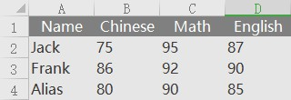

# virtual DOM 
## virtual DOM  是什么?
> if you are using React, there is a better chance you have heard about virtual DOM. In a nutshell, virtual DOM is an abstract version of the DOM, a lightweight copy of the actual DOM which we can manipulate the way we want and then apply to the DOM tree.

virtual DOM就是抽象版本的DOM，用一个虚拟的数据结构代表要展示的DOM结构，我们对这个虚拟的数据结构进行操作进而更新DOM树。
虚拟DOM对象形如：
```js
var Vnodes = {
    tag:"ul",
    props:{ id:"list" },
    children:[
        {tag:"li",props:{class:"item"},children:["item1"]},
        {tag:"li",props:{class:"item"},children:["item2"]},
        {tag:"li",props:{class:"item"},children:["item3"]},
    ]
}
```
这就可以说是一个虚拟的DOM结构,表示出来就是：
```html
<ul id="list">
    <li class="item">item1</li>
    <li class="item">item2</li>
    <li class="item">item3</li>
</ul>
```
## virtual DOM  解决了什么问题?
操作DOM无非就是增删改查和重排序，在有些时候手动操作DOM是非常麻烦的。

场景1：页面内多处需要改动。需要多处获取节点，如果改的地方还没有共同点，需要一个一个来获取，一个一个改。

场景2：页面内同一地方需要多次不同的改动（增删改查）。需要保存此节点进行多种操作方式。

场景3：根据不同的条件对表格数据排序。需要对象保存数据，每次排序都需要清空div，重新创建节点进行保存，然后append，如此大型改动必然要对页面进行重排。

...

可想而知，js文件需要堆砌多少代码，且不说js文件的大小。手动DOM操作和跟踪以前的DOM状态是困难而混乱的，并且多次操作DOM会影响页面的加载速度，只要改变DOM树就会影响性能。

> virtual-dom is a collection of modules designed to provide a declarative way of representing the DOM for your app. So instead of updating the DOM when your application state changes, you simply create a virtual tree or VTree, which looks like the DOM state that you want. virtual-dom will then figure out how to make the DOM look like this efficiently without recreating all of the DOM nodes.

> virtual-dom allows you to update a view whenever state changes by creating a full VTree of the view and then patching the DOM efficiently to look exactly as you described it. This results in keeping manual DOM manipulation and previous state tracking out of your application code, promoting clean and maintainable rendering logic for web applications.

virtual DOM 作用在于：当DOM状态发生改变时，创建一个虚拟的DOM,看起来像DOM, 然后将前后两种状态进行比对，只对不同的地方进行DOM修补。


## 如何实现 virtual DOM?
1. 用将页面内容抽象为js对象
2. JS对象模拟DOM树 实现真假DOM的转换
2. 比较两棵虚拟DOM树的差异
3. 把差异应用到真正的DOM树上

实例：利用虚拟DOM模拟EXCEL排序功能



步骤一：用JS对象模拟DOM树

```js
// 构造 table DOM 形如：
  let tableVDOM = el('table', null, [
      el('tr', {id: 'head' }, [
          el('th', { id: 'name',className: "active"},["Name"]),
          el('th', { id: 'chinese', className: " "},  ["Chinese"]),
          el('th', { id: 'math', className: " "},  ["Math"]),
          el('th', { id: 'english', className: " "},  ["English"])
      ]),
      el('tr', null, [
          el('td', null,["Jack"]),
          el('td', null,  ["75"]),
          el('td', null,  ["95"]),
          el('td', null,  ["87"])
      ]),
      el('tr', null, [
          el('td', null,["Frank"]),
          el('td', null,  ["86"]),
          el('td', null,  ["92"]),
          el('td', null,  ["90"])
      ]),
      el('tr', null, [
          el('td', null,["Alias"]),
          el('td', null,  ["80"]),
          el('td', null,  ["90"]),
          el('td', null,  ["85"])
      ])  
  ])
```
步骤二：比较两棵虚拟DOM树的差异

差异类型:

1. 节点替换
2. 节点移动，删除、新增子节点
3. 修改了节点的属性 class的修改
4. 文本修改 

待续...


## 其他
目前 react已经实现了虚拟DOM

## Appendix:
[深度剖析：如何实现一个 Virtual DOM 算法](https://github.com/livoras/blog/issues/13)
